# Análisis Arquitectónico de Base de Datos (BULONERA ERP)

Este documento centraliza el modelado visual (ER), los flujos transaccionales y el análisis de ingeniería inversa de la base de datos de BULONERA ERP, diseñado específicamente para ser procesado por los agentes (cerebros de NotebookLM / Obsidian).

## MODO 5: 📊 Diagrama de Base de Datos (Mermaid erDiagram)

A continuación, se presenta la topología relacional extraída dinámicamente de los modelos de Django. Para optimizar el renderizado, se han excluido los campos de auditoría genéricos (`created_at`, `updated_at`, `deleted_at`).

```mermaid
erDiagram
    User {
        ForeignKey logentry
        ForeignKey outstandingtoken
        ForeignKey user_created_by
        ForeignKey user_updated_by
        ForeignKey user_deleted_by
        ForeignKey userlog_created_by
        ForeignKey userlog_updated_by
        ForeignKey userlog_deleted_by
        ForeignKey logs
        ForeignKey registrationrequest_created_by
        ForeignKey registrationrequest_updated_by
        ForeignKey registrationrequest_deleted_by
        ForeignKey reviewed_requests
        ForeignKey emaillog_created_by
        ForeignKey emaillog_updated_by
        ForeignKey emaillog_deleted_by
        ForeignKey audit_logs
        ForeignKey customersegment_created_by
        ForeignKey customersegment_updated_by
        ForeignKey customersegment_deleted_by
        ForeignKey customer_created_by
        ForeignKey customer_updated_by
        ForeignKey customer_deleted_by
        ForeignKey customernote_created_by
        ForeignKey customernote_updated_by
        ForeignKey customernote_deleted_by
        ForeignKey quote_created_by
        ForeignKey quote_updated_by
        ForeignKey quote_deleted_by
        ForeignKey quoteitem_created_by
        ForeignKey quoteitem_updated_by
        ForeignKey quoteitem_deleted_by
        ForeignKey sale_updated_by
        ForeignKey sale_deleted_by
        ForeignKey created_sales
        ForeignKey stock_reservations
        ForeignKey saleitem_created_by
        ForeignKey saleitem_updated_by
        ForeignKey saleitem_deleted_by
        ForeignKey quoteconversion_created_by
        ForeignKey quoteconversion_updated_by
        ForeignKey quoteconversion_deleted_by
        ForeignKey quoteconversion
        ForeignKey category_created_by
        ForeignKey category_updated_by
        ForeignKey category_deleted_by
        ForeignKey subcategory_created_by
        ForeignKey subcategory_updated_by
        ForeignKey subcategory_deleted_by
        ForeignKey product_created_by
        ForeignKey product_updated_by
        ForeignKey product_deleted_by
        ForeignKey pricelist_created_by
        ForeignKey pricelist_updated_by
        ForeignKey pricelist_deleted_by
        ForeignKey productimage_created_by
        ForeignKey productimage_updated_by
        ForeignKey productimage_deleted_by
        ForeignKey stockmovement_created_by
        ForeignKey stockmovement_updated_by
        ForeignKey stockmovement_deleted_by
        ForeignKey stockcount_created_by
        ForeignKey stockcount_updated_by
        ForeignKey stockcount_deleted_by
        ForeignKey stock_counts
        ForeignKey stockcountitem_created_by
        ForeignKey stockcountitem_updated_by
        ForeignKey stockcountitem_deleted_by
        ForeignKey payment_created_by
        ForeignKey payment_updated_by
        ForeignKey payment_deleted_by
        ForeignKey paymentallocation_created_by
        ForeignKey paymentallocation_updated_by
        ForeignKey paymentallocation_deleted_by
        ForeignKey invoice_created_by
        ForeignKey invoice_updated_by
        ForeignKey invoice_deleted_by
        ForeignKey facturas_emitidas
        ForeignKey invoiceitem_created_by
        ForeignKey invoiceitem_updated_by
        ForeignKey invoiceitem_deleted_by
        ForeignKey suppliertag_created_by
        ForeignKey suppliertag_updated_by
        ForeignKey suppliertag_deleted_by
        ForeignKey supplier_created_by
        ForeignKey supplier_updated_by
        ForeignKey supplier_deleted_by
        ForeignKey expensecategory_created_by
        ForeignKey expensecategory_updated_by
        ForeignKey expensecategory_deleted_by
        ForeignKey expense_created_by
        ForeignKey expense_updated_by
        ForeignKey expense_deleted_by
        CharField password
        DateTimeField last_login
        BooleanField is_superuser
        CharField username
        CharField first_name
        CharField last_name
        BooleanField is_staff
        DateTimeField date_joined
        CharField email
        BooleanField password_change_required
        CharField role
        DateTimeField last_access
        BooleanField can_manage_users
        BooleanField can_manage_products
        BooleanField can_manage_customers
        BooleanField can_manage_sales
        BooleanField can_manage_quotes
        BooleanField can_manage_inventory
        BooleanField can_manage_payments
        BooleanField can_manage_bills
        BooleanField can_manage_suppliers
        BooleanField can_view_reports
    }
    UserLog {
        CharField action
        TextField details
    }
    CustomerSegment {
        ForeignKey customers
        ForeignKey sales_with_segment_discount
        CharField name
        TextField description
        CharField color
        DecimalField discount_percentage
    }
    Customer {
        ForeignKey customer_notes
        ForeignKey quotes
        ForeignKey sales
        ForeignKey payments
        ForeignKey facturas
        CharField customer_type
        CharField business_name
        CharField trade_name
        CharField cuit_cuil
        CharField tax_condition
        CharField email
        CharField phone
        CharField mobile
        CharField website
        CharField contact_person
        CharField billing_address
        CharField billing_city
        CharField billing_state
        CharField billing_zip_code
        CharField billing_country
        IntegerField payment_term
        DecimalField credit_limit
        DecimalField discount_percentage
        BooleanField allow_credit
        CharField account_modality
        TextField notes
    }
    CustomerNote {
        CharField title
        TextField content
        BooleanField is_important
    }
    Quote {
        ForeignKey items
        UUIDField uuid
        CharField number
        DateField date
        DateField valid_until
        CharField customer_name
        CharField customer_phone
        CharField customer_email
        CharField customer_cuit
        CharField status
        BooleanField is_printed
        BooleanField sent_via_wa
        BooleanField sent_via_email
        TextField notes
        TextField internal_notes
        DecimalField _cached_subtotal
        DecimalField _cached_discount
        DecimalField _cached_tax
        DecimalField _cached_total
    }
    QuoteItem {
        DecimalField quantity
        DecimalField unit_price
        CharField discount_type
        DecimalField discount_value
        CharField discount_reason
        DecimalField tax_percentage
        TextField notes
        PositiveIntegerField line_order
        CharField calculation_mode
        DecimalField target_total
    }
    Sale {
        ForeignKey items
        ForeignKey payment_allocations
        ForeignKey facturas
        ForeignKey comprobantes_arca
        CharField number
        DateTimeField date
        DateTimeField confirmed_at
        CharField customer_name
        CharField customer_phone
        CharField customer_email
        CharField customer_cuit
        CharField status
        CharField payment_status
        CharField fiscal_status
        CharField payment_method
        BooleanField is_credit_sale
        TextField notes
        TextField internal_notes
        TextField delivery_address
        DateField delivery_date
        DateTimeField stock_reserved_at
        DecimalField _cached_subtotal
        DecimalField _cached_discount
        DecimalField _cached_tax
        DecimalField _cached_total
        CharField global_discount_type
        DecimalField global_discount_value
        CharField global_discount_reason
        CharField sync_status
        CharField local_id
        PositiveIntegerField version
        DateTimeField sync_last_attempt
        DateTimeField sync_succeeded_at
        PositiveIntegerField sync_attempt_count
        TextField sync_error
        CharField conflict_resolution
        JSONField conflict_data
    }
    SaleItem {
        DecimalField quantity
        DecimalField unit_price
        DecimalField unit_cost
        CharField discount_type
        DecimalField discount_value
        CharField discount_reason
        DecimalField tax_percentage
        TextField notes
        PositiveIntegerField line_order
    }
    Category {
        ForeignKey subcategories
        ForeignKey products
        CharField name
        SlugField slug
        TextField description
        FileField image
        IntegerField order
    }
    Subcategory {
        CharField name
        SlugField slug
        TextField description
        JSONField faqs
    }
    Product {
        ForeignKey quoteitem
        ForeignKey sale_items
        ForeignKey images
        ForeignKey stock_movements
        ForeignKey count_items
        CharField code
        CharField sku
        CharField other_codes
        CharField name
        SlugField slug
        TextField description
        DecimalField price
        DecimalField cost
        DecimalField tax_rate
        CharField diameter
        CharField length
        CharField material
        CharField grade
        CharField norm
        CharField colour
        CharField product_type
        CharField form
        CharField thread_format
        CharField origin
        CharField brand
        CharField barcode
        CharField qr_code
        CharField gtin
        CharField mpn
        IntegerField stock_quantity
        IntegerField min_stock
        BooleanField stock_control_enabled
        CharField unit_of_sale
        IntegerField min_sale_unit
        DateField last_purchase_date
        DecimalField last_purchase_price
        FileField main_image
        CharField condition
        CharField meta_title
        TextField meta_description
        CharField meta_keywords
        CharField google_category
        IntegerField sold_count
    }
    StockMovement {
        CharField movement_type
        PositiveIntegerField quantity
        CharField reference
        TextField notes
        IntegerField previous_stock
        IntegerField new_stock
    }
    Payment {
        ForeignKey allocations
        DecimalField amount
        CharField method
        CharField status
        CharField reference
        DateField date
        TextField notes
    }
    PaymentAllocation {
        DecimalField allocated_amount
        TextField notes
    }
    Invoice {
        ForeignKey payment_allocations
        ForeignKey items
        UUIDField uuid
        CharField number
        IntegerField tipo_comprobante
        IntegerField punto_venta
        IntegerField numero_secuencial
        CharField cliente_cuit
        CharField cliente_razon_social
        CharField cliente_condicion_iva
        CharField cliente_domicilio
        DecimalField subtotal
        DecimalField descuento_total
        DecimalField neto_gravado
        DecimalField monto_iva
        DecimalField monto_no_gravado
        DecimalField monto_exento
        DecimalField total
        CharField cae
        DateField cae_vencimiento
        CharField estado_fiscal
        TextField observaciones_afip
        DateField fecha_emision
        DateField fecha_vto_pago
        TextField observaciones
    }
    InvoiceItem {
        CharField producto_nombre
        CharField producto_codigo
        DecimalField cantidad
        DecimalField precio_unitario
        DecimalField descuento
        DecimalField subtotal
        DecimalField alicuota_iva
        DecimalField monto_iva
        DecimalField total
        PositiveIntegerField numero_linea
    }
    Comprobante {
        ForeignKey renglones
        ForeignKey logarca
        IntegerField tipo_compr
        IntegerField punto_venta
        IntegerField numero
        DateField fecha_compr
        IntegerField cbte_asoc_tipo
        IntegerField cbte_asoc_pto_vta
        IntegerField cbte_asoc_numero
        DateField fecha_vto_pago
        IntegerField doc_cliente_tipo
        CharField doc_cliente
        CharField razon_social_cliente
        IntegerField condicion_iva_receptor
        DecimalField monto_neto
        DecimalField monto_iva
        DecimalField monto_total
        CharField cae
        DateField fecha_vto_cae
        CharField estado
        JSONField respuesta_arca_json
        TextField error_msg
        DateTimeField creado_en
        DateTimeField actualizado_en
        CharField usuario_creacion
    }
    Supplier {
        ForeignKey products
        ForeignKey expenses
        CharField business_name
        CharField trade_name
        CharField cuit
        CharField tax_condition
        CharField email
        CharField phone
        CharField mobile
        CharField website
        CharField address
        CharField city
        CharField state
        CharField zip_code
        CharField bank_name
        CharField cbu
        CharField bank_alias
        CharField contact_person
        CharField contact_email
        CharField contact_phone
        IntegerField payment_term
        IntegerField payment_day_of_month
        DecimalField early_payment_discount
        IntegerField delivery_days
        TextField notes
        DateField last_price_list_date
        DateField last_purchase_date
        DecimalField last_purchase_amount
        DecimalField total_purchased
        DecimalField current_debt
    }
    ExpenseCategory {
        ForeignKey expenses
        CharField name
        CharField type
        TextField description
    }
    Expense {
        CharField description
        DecimalField amount_neto
        DecimalField amount_iva
        DecimalField amount_total
        DateField expense_date
        DateField payment_date
        BooleanField is_paid
        PositiveSmallIntegerField period_year
        PositiveSmallIntegerField period_month
        BooleanField is_recurring
        CharField recurrence
        TextField notes
    }
    UserLog }o--|| User : "user"
    Customer }o--|| CustomerSegment : "customer_segment"
    CustomerNote }o--|| Customer : "customer"
    Quote ||--|| Sale : "converted_sale"
    Quote }o--|| Customer : "customer"
    QuoteItem }o--|| Quote : "quote"
    QuoteItem }o--|| Product : "product"
    Sale }o--|| Customer : "customer"
    Sale ||--|| Quote : "quote"
    Sale }o--|| User : "stock_reserved_by"
    Sale }o--|| CustomerSegment : "customer_segment_discount"
    SaleItem }o--|| Sale : "sale"
    SaleItem }o--|| Product : "product"
    Subcategory }o--o{ Product : "products"
    Subcategory }o--|| Category : "category"
    Product }o--|| Category : "category"
    Product }o--|| Supplier : "supplier"
    Product }o--o{ Subcategory : "subcategories"
    StockMovement }o--|| Product : "product"
    Payment }o--|| Customer : "customer"
    PaymentAllocation }o--|| Payment : "payment"
    PaymentAllocation }o--|| Sale : "sale"
    PaymentAllocation }o--|| Invoice : "invoice"
    Invoice }o--|| Sale : "sale"
    Invoice ||--|| Comprobante : "comprobante_arca"
    Invoice }o--|| Customer : "customer"
    Invoice }o--|| User : "emitida_por"
    InvoiceItem }o--|| Invoice : "invoice"
    Comprobante ||--|| Invoice : "factura"
    Comprobante }o--|| Sale : "sale"
    Expense }o--|| ExpenseCategory : "category"
    Expense }o--|| Supplier : "supplier"
```



## MODO 4: ⚙️ Flujos de Transacciones y Lógica de Persistencia

Al analizar la capa de servicios (`services.py`), se han identificado los siguientes flujos críticos protegidos por `@transaction.atomic` para asegurar consistencia ACID en MariaDB y prevenir *race conditions* de inventario.

### 1. Gestión de Stock (Inventory)
- **Bloqueos:** 6 transacciones atómicas localizadas en `inventory/services.py`.
- **Flujo:** Las reservas de stock (desde Ventas) y los ajustes manuales realizan un bloqueo de la fila del producto (típicamente mediante `select_for_update()`) para recalcular el `stock_quantity` basándose en el historial de `StockMovement`.

### 2. Procesamiento de Ventas y Pagos (Sales & Payments)
- **Bloqueos:** 4 transacciones atómicas localizadas en `payments/services.py`.
- **Flujo:** Al registrar un `Payment`, se generan instancias de `PaymentAllocation` para distribuir el saldo sobre una `Sale` o `Invoice`. Esto se realiza atómicamente para prevenir la generación de saldo a favor fantasma si falla la red en Hostinger.

### 3. Operaciones de Productos y Precios (Products) - Asíncronas
- **Decisión de Negocio / Arquitectura:** Para evitar bloqueos prolongados de tablas InnoDB en el VPS compartido (lo cual podría interrumpir el tráfico de la web de ventas comercial), se establece que las actualizaciones masivas de listas de precios y costos deben ejecutarse de manera **asíncrona** a través de colas de tareas con Celery + Redis.
- **Flujo Transaccional:**
  ```mermaid
  sequenceDiagram
      autonumber
      Client->>API (services.py): Subir Lista de Precios / Solicitar Actualización Masiva
      API (services.py)->>Celery Queue: Despachar Tarea (task_bulk_update_prices)
      API (services.py)-->>Client: HTTP 202 Accepted (Task ID)
      loop Procesamiento por Lotes (Chunk size = 100)
          Celery Worker->>MariaDB (InnoDB): SELECT for update (lote limitado)
          Celery Worker->>MariaDB (InnoDB): bulk_update() / COMMIT
      end
      Celery Worker->>Client: Notificación de finalización (opcional)
  ```
- **Lógica de Persistencia:** En `products/services.py`, se implementará una transacción por lote limitado (chunking) dentro de la tarea asíncrona para evitar que un único rollback cancele toda la lista si hay fallas en un solo producto, y para liberar bloqueos rápidamente:
  ```python
  # products/services.py (Procesamiento asincrónico por lotes)
  @shared_task
  def update_prices_in_background(price_data_list):
      chunk_size = 100
      for i in range(0, len(price_data_list), chunk_size):
          chunk = price_data_list[i:i + chunk_size]
          with transaction.atomic():
              # Evita bloqueos prolongados de filas de productos
              products_to_update = []
              for item in chunk:
                  product = Product.objects.select_for_update().get(sku=item['sku'])
                  product.price = item['new_price']
                  product.cost = item['new_cost']
                  products_to_update.append(product)
              Product.objects.bulk_update(products_to_update, ['price', 'cost'])
  ```

### 4. Proveedores y Gastos (Suppliers & Expenses)
- **Bloqueos:** Múltiples bloques detectados (3 en proveedores, 4 en gastos).
- **Flujo:** El impacto de un gasto (`Expense`) en la deuda actual del proveedor (`Supplier.current_debt`) se computa y persiste simultáneamente.

---

## MODO 6: 📝 Decisiones de Diseño y Performance en Hostinger (Ingeniería Inversa)

El escaneo del código fuente y los modelos revela una salud estructural **alta (Score: 8.5/10)**.

- **Decisión 1 (Tipos Numéricos Precisos):** Se utilizan campos `DecimalField` masivamente para precios, costos, impuestos y descuentos en lugar de `FloatField`. 
  - *Trade-off:* Garantiza la precisión que exige AFIP sin desbordes de coma flotante, a costa de ocupar marginalmente más bytes en el row storage de InnoDB.
- **Decisión 2 (Campos Cacheados):** Modelos transaccionales como `Sale` y `Quote` implementan atributos desnormalizados (ej. `_cached_total`, `_cached_tax`).
  - *Trade-off:* Minimiza el uso de CPU (agregaciones pesadas de `SUM`) del servidor Hostinger al consultar historiales, intercambiando velocidad de lectura a cambio de mantener triggers/lógica en Python para sincronizar el cache (aumenta tiempo de escritura).
- **Decisión 3 (Auditoría Centralizada):** Presencia exhaustiva de claves foráneas `created_by`, `updated_by` apuntando a `User` en virtualmente todos los modelos.
  - *Trade-off:* Excelente trazabilidad fiscal y operativa. El riesgo de rendimiento en consultas `SELECT *` masivas en VPS se reduce limitando el depth en los serializers (evitando N+1 *queries*).
- **Decisión 4 (Procesamiento Asíncrono de Precios):** Adopción de Celery + Redis para la actualización masiva de precios del catálogo.
  - *Trade-off:* Se introduce infraestructura adicional (Redis y un proceso Worker corriendo en background en el VPS), lo que consume memoria RAM fija de forma persistente. Sin embargo, elimina los picos de CPU al 100% y bloqueos de tabla prolongados (evitando la caída de la web comercial).
- **Decisión 5 (Retención de Soft-Deletes):** No se diseñarán crons ni scripts de purgado físico de soft-deletes (`deleted_at`).
  - *Trade-off:* Se prioriza la simplicidad y la integridad histórica exigida por la AFIP. A largo plazo esto incrementará levemente el tamaño de los índices en InnoDB, pero se considera insignificante para el volumen de datos esperado en la bulonería.

---

## ⚠️ Suposiciones de Negocio
- `[Suposición: Ventas Flexibles]`: Por el modelado de `QuoteItem` y `SaleItem` (uso de `DecimalField` en `quantity`), asumo que los productos admiten venta fraccionada (ej. venta por kilo de tornillos), lo cual está alineado con el Enterprise Context de Bulonera Alvear.
- `[Suposición: Facturación Mixta]`: Al existir `Sale` sin vinculación estricta 1:1 obligatoria en el mismo momento con `Invoice` / `Comprobante` (la FK no es strict), el ERP permite realizar ventas en remito/borrador antes de la liquidación oficial de AFIP (ARCA).
