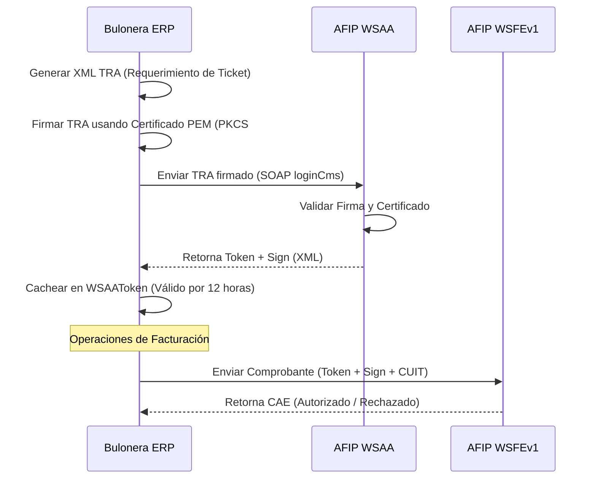

# 🔑 Autenticación WSAA y Protocolo SOAP

Este documento detalla el mecanismo de autenticación criptográfica de **BULONERA ERP** con la AFIP, cubriendo el ciclo del WSAA (Web Service de Autenticación y Autorización) y el consumo de servicios SOAP.

---

## 🔒 Gestión de Certificados y Claves Privadas

La comunicación con los servicios web de la AFIP exige el uso de firmas criptográficas basadas en certificados X.509 y claves privadas RSA generadas oficialmente:

*   **Ruta de Certificados:** Configurada en `ConfiguracionARCA.ruta_certificado` (típicamente mapeada dentro de Docker en `/app/afip/certs/` en modo de solo lectura `:ro`).
*   **Archivos PEM:** Contienen la combinación del certificado público de la empresa y la clave privada RSA correspondiente.
*   **Ambientes:**
    *   `homologacion` (Pruebas): Utiliza la clave y certificado provistos por AFIP en su sandbox fiscal.
    *   `produccion` (Producción): Utiliza credenciales reales asociadas al CUIT de **MELA MIGUEL ANGEL** delegadas a través del Administrador de Relaciones de la AFIP.

---

## 🎟️ Ciclo de Autenticación WSAA

La AFIP no utiliza autenticación por API Keys tradicionales. En su lugar, implementa un esquema de tickets de acceso temporales:



1.  **Ticket de Requerimiento de Acceso (TRA):**
    Un documento XML que especifica el CUIT emisor, el servicio destino (`wsfe`, `ws_sr_constancia_inscripcion`) y una marca temporal de vigencia.
2.  **Firma PKCS#7 (CMS):**
    La librería de criptografía (OpenSSL) firma el XML utilizando la clave privada del emisor y genera una envoltura criptográfica (CMS).
3.  **Llamada `loginCms`:**
    Se transmite el TRA firmado en base64 mediante una solicitud SOAP. La AFIP responde con un XML que contiene un `Token` y un `Sign` (firma de la AFIP).
4.  **Caché en Base de Datos:**
    El token se almacena en la tabla `afip_wsaatoken`. Cada llamada a facturación invoca `WSAAToken.obtener_token_vigente()`, evitando renegociar con la AFIP si el token actual sigue vigente (expira a las 12 horas; se renueva si le quedan menos de 5 minutos de vida).

---

## 📡 Protocolo SOAP y Librería Zeep

El ERP consume los servicios mediante la librería de Python **Zeep**, aplicando las siguientes configuraciones de rendimiento y robustez:

*   **WSDLs Locales:** Para evitar latencia y fallos al descargar las definiciones de la AFIP en caliente, el sistema utiliza archivos locales estáticos ([wsdl.xml](file:///c:/Users/frank/Desktop/BULONERA_ERP/afip/wsdl.xml) y [wsdl_padron.xml](file:///c:/Users/frank/Desktop/BULONERA_ERP/afip/wsdl_padron.xml)).
*   **Estructura del SOAP Envelope:**
    Todas las peticiones a la API del Web Service de Facturación (WSFEv1) envían como cabecera un objeto de autorización:
    ```xml
    <FEAuthRequest>
        <Token>string_token_wsaa</Token>
        <Sign>string_sign_wsaa</Sign>
        <Cuit>cuit_emisor</Cuit>
    </FEAuthRequest>
    ```

---

## 📜 Logs e Inmutabilidad (`LogARCA`)

Cada transacción SOAP física con la AFIP se registra en la tabla `afip_logarca`.
*   **Inmutabilidad:** No admite borrado lógico. Las filas se insertan directamente de forma física y no se editan.
*   **Depuración:** Guarda el request XML original y la respuesta XML de AFIP. Si ocurre un fallo en los servidores de AFIP, se puede inspeccionar la respuesta exacta devuelta por el servidor (incluyendo errores SOAP de nivel HTTP 500).
