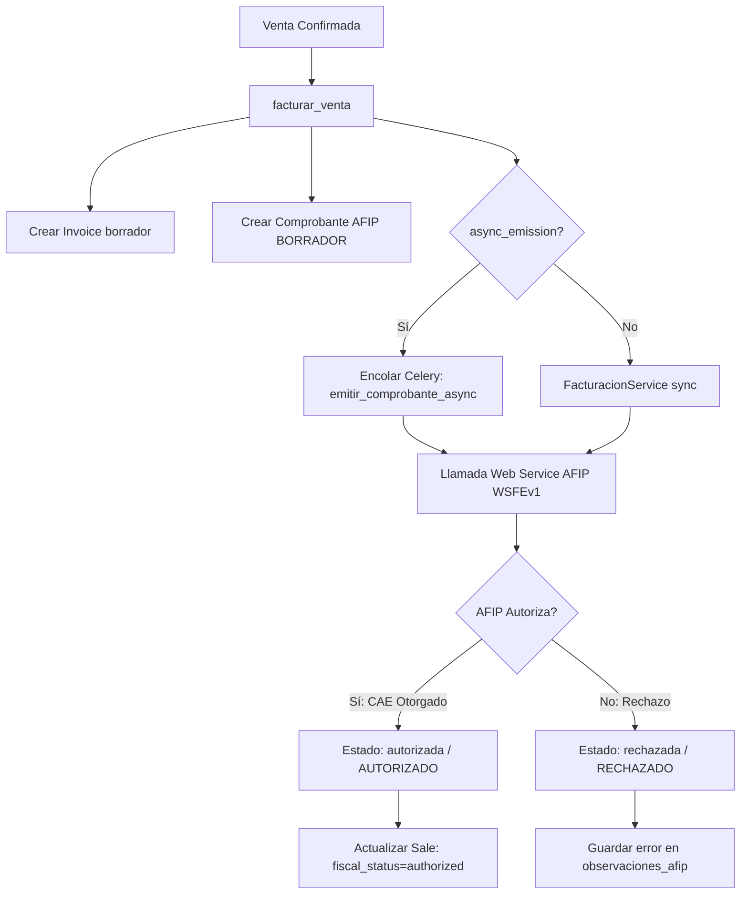

# ⚖️ Integración Fiscal (AFIP / ARCA) y Notas de Crédito

Este documento detalla el diseño técnico de la integración fiscal de **BULONERA ERP** con la AFIP (Administración Federal de Ingresos Públicos), cubriendo la emisión asíncrona de facturas electrónicas y el flujo de anulación mediante Notas de Crédito.

---

## 🔄 Flujo de Facturación Electrónica (Celery Async)

La comunicación con los servidores de la AFIP puede sufrir latencias o caídas temporales. Para no bloquear la interfaz del usuario, la facturación se realiza de manera **asíncrona** por defecto:

### 1. Preparación y Validación Local
Antes de contactar a AFIP, el servicio valida en base de datos local:
*   La venta debe estar confirmada y contar con un método de pago seleccionado.
*   No debe haberse emitido una factura previa del mismo tipo.
*   Se sincroniza la condición fiscal del cliente mediante consulta directa (o fallback local) a los padrones de AFIP.
*   **Seguridad:** Se bloquea la facturación si el CUIT del cliente coincide con el CUIT emisor de la empresa (evitando el error de AFIP 10069).

### 2. Mapeo Impositivo y Tipo de Comprobante
El sistema traduce automáticamente las condiciones locales a los códigos requeridos por el Web Service WSFEv1:
*   **Condición del IVA Receptor:**
    *   `RI` (Responsable Inscripto) $\rightarrow$ Código 1
    *   `EX` (Exento) $\rightarrow$ Código 4
    *   `CF` (Consumidor Final) $\rightarrow$ Código 5
    *   `MONO` (Monotributista) $\rightarrow$ Código 6
*   **Tipo de Comprobante (Emisor es Responsable Inscripto):**
    *   Venta a Cliente RI $\rightarrow$ Tipo 1 (Factura A)
    *   Venta a Cliente MONO, CF, EX $\rightarrow$ Tipo 6 (Factura B)

---

## 🚫 Flujo de Anulación Automática (Nota de Crédito)

Cuando un operador decide anular una venta o una factura ya autorizada por la AFIP mediante [anular_factura_y_venta](file:///c:/Users/frank/Desktop/BULONERA_ERP/bills/services.py#L377-L506), se activa el siguiente flujo transaccional:

1.  **Mapeo de Contra-comprobante:**
    *   Factura A (1) $\rightarrow$ Nota de Crédito A (3)
    *   Factura B (6) $\rightarrow$ Nota de Crédito B (8)
    *   Tique Factura A (81) $\rightarrow$ Nota de Crédito Tique A (85)
    *   Tique Factura B (82) $\rightarrow$ Nota de Crédito Tique B (86)
2.  **Vinculación del Comprobante Asociado:**
    Se genera una Nota de Crédito borrador en la AFIP y se asocian obligatoriamente los campos `cbte_asoc_tipo`, `cbte_asoc_pto_vta` y `cbte_asoc_numero` de la factura original para cumplir con la reglamentación fiscal de trazabilidad de devoluciones.
3.  **Emisión Sincrónica a AFIP:**
    La Nota de Crédito se envía de forma sincrónica para garantizar su aprobación antes de procesar cambios locales. Si la AFIP la rechaza, la transacción se aborta (rollback) y no se modifica el estado de la venta ni del stock.
4.  **Reversión en Cascada Local:**
    Si la AFIP aprueba la Nota de Crédito:
    *   Se crea un `Invoice` con montos negativos (reflejando la devolución de dinero).
    *   La factura original pasa a `estado_fiscal='anulada'`.
    *   Se cancela la venta asociada (`cancel_sale`), devolviendo los productos al inventario.
    *   Se ejecuta el hook `PaymentService.handle_credit_note_impact` para liberar las alocaciones de cobros y dejar los saldos a cuenta del cliente como saldo disponible.
