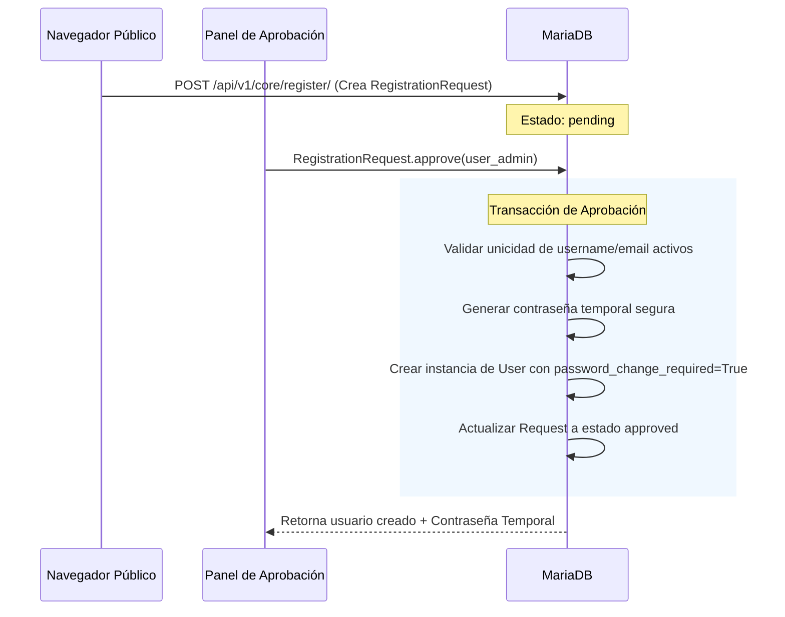

# 🔑 Matriz de Roles y Liberación de Identificadores

Este documento detalla el control de acceso en **BULONERA ERP**, explicando la jerarquía de roles, la matriz de permisos de seguridad y el comportamiento del borrado lógico de usuarios para liberar credenciales.

---

## 👥 Jerarquía de Roles de Usuario

El sistema cuenta con cinco roles definidos en la propiedad `User.role`. Las clases de permisos (`HasPermission`, `ModulePermission`) evalúan esta propiedad de forma jerárquica:

```
  ┌────────────────────────────────────────────────────────┐
  │                        admin                           │ (Superusuario: Bypassea todas las restricciones)
  └──────────────────────────┬─────────────────────────────┘
                             ▼
  ┌────────────────────────────────────────────────────────┐
  │                       manager                          │ (Gerente: Permiso total de escritura/lectura comercial)
  └──────────────────────────┬─────────────────────────────┘
                             ▼
  ┌────────────────────────────────────────────────────────┐
  │                      operator                          │ (Operador de salón: Se validan sus flags can_manage_*)
  └──────────────────────────┬─────────────────────────────┘
                             ▼
  ┌────────────────────────────────────────────────────────┐
  │                       viewer                           │ (Auditor/Visualizador: Solo métodos GET, HEAD, OPTIONS)
  └──────────────────────────┬─────────────────────────────┘
                             ▼
  ┌────────────────────────────────────────────────────────┐
  │                        user                            │ (Usuario base: Sin permisos comerciales)
  └────────────────────────────────────────────────────────┘
```

### Flags de Permisos Específicos (`operator`)
Para los operadores, el sistema evalúa permisos granulares en base a campos booleanos:
*   `can_manage_sales` / `can_manage_quotes`
*   `can_manage_inventory`
*   `can_manage_payments` / `can_manage_bills`
*   `can_manage_customers` / `can_manage_suppliers`
*   `can_view_reports`

---

## 🔄 Liberación de Identificadores (Soft-Delete de Usuarios)

### El Problema
Django y MariaDB exigen que el campo `username` sea único a nivel de base de datos (`unique=True`). Si un usuario llamado `vendedor1` es eliminado lógicamente (soft-delete, `deleted_at` no nulo), su registro sigue existiendo físicamente en la base de datos. Si intentáramos registrar a un nuevo usuario con el username `vendedor1`, el sistema fallaría por una violación de restricción de integridad de la base de datos.

### La Solución: "Mangling" en `User.delete`
Para resolver esto, el método `delete()` de `User` sobrescribe el comportamiento por defecto:
1.  **Eliminación Lógica:** Al borrar al usuario, se calcula un prefijo dinámico:
    $$\text{prefix} = \text{"\_\_deleted\_" + user.id + "\_"}$$
2.  **Modificación del Identificador (Mangling):** El `username` y el `email` se reescriben anteponiendo este prefijo (ej. `vendedor1` pasa a ser `__deleted_42_vendedor1`). Esto libera inmediatamente los valores originales `vendedor1` y `vendedor@mail.com` en la base de datos.
3.  **Restauración (`restore`):** Si un administrador decide restaurar la cuenta del usuario, el método `restore()` remueve el prefijo para recuperar las credenciales de acceso originales.

---

## 📝 Flujo de Registro y Aprobación de Cuentas


*   **Contraseña Temporal:** Se genera utilizando `secrets.token_urlsafe(12)`.
*   **Cambio Obligatorio:** El campo `password_change_required=True` obliga al usuario a redefinir su clave en su primer inicio de sesión mediante el endpoint `/profile/` antes de poder consumir APIs comerciales.
