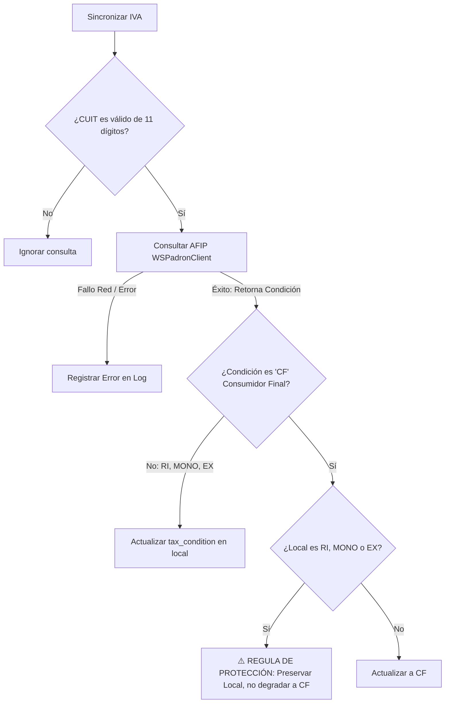

# ⚖️ Sincronización Fiscal de Clientes y Protección del IVA

Este documento detalla el algoritmo de validación de CUITs y la lógica de protección del IVA aplicada al sincronizar los datos de clientes contra el padrón impositivo de la AFIP en **BULONERA ERP**.

---

## 🔢 Validación de CUIT/CUIL (Checksum Modulus 11)

Antes de guardar o sincronizar cualquier cliente, el sistema valida la estructura del CUIT/CUIL/DNI mediante el validador [validate_cuit_checksum](file:///c:/Users/frank/Desktop/BULONERA_ERP/customers/models.py#L53-L58):

1.  **Formatos Admitidos:** Se admiten números sin guiones, con longitud entre 7 y 11 dígitos.
2.  **Dígito Verificador (Modulus 11):** Para identificadores de 11 dígitos, se ejecuta el cálculo de checksum oficial de la AFIP:
    *   Se multiplican los primeros 10 dígitos por los factores de ponderación correspondientes: `[5, 4, 3, 2, 7, 6, 5, 4, 3, 2]`.
    *   Se calcula la suma de los productos.
    *   El resto de la división por 11 determina el dígito verificador. Si el cálculo no coincide con el último dígito ingresado, el registro es rechazado con un error de validación (`ValidationError`).

---

## 🛡️ Regla de Protección Impositiva en la Sincronización

La sincronización de la condición de IVA se realiza mediante el servicio `sincronizar_condicion_iva(customer)`.
Debido a inconsistencias comunes en los padrones impositivos o restricciones temporales en las consultas automáticas de la AFIP, se ha diseñado una regla de protección del IVA para evitar degradaciones involuntarias de cuentas de clientes:

### El Flujo de Decisión:

### Justificación de la Regla:
Cuando el padrón de AFIP no tiene registros impositivos actualizados de un CUIT (o devuelve un error de persona no registrada), suele reportar por defecto la condición de **Consumidor Final (CF)**. 
Si el cliente es una empresa y localmente ya está configurado como **Responsable Inscripto (RI)** (lo cual fue validado por su documentación física de IVA), sobreescribir este dato con `'CF'` causaría que el sistema emita Facturas B en lugar de Facturas A, generando un problema fiscal grave.

Por lo tanto, el sistema **nunca** sobrescribe con `'CF'` a un cliente que localmente ya posee una condición de IVA más específica (`'RI'`, `'MONO'`, `'EX'`).
