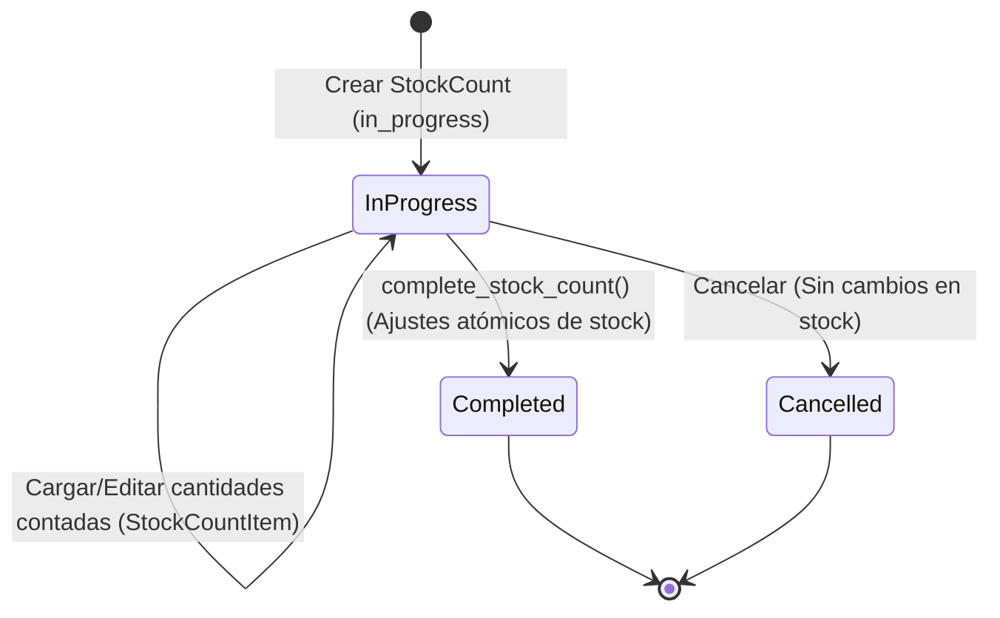

# 📈 Flujo de Conteo Físico Progresivo

Este documento detalla el ciclo de vida de los inventarios físicos y las auditorías de stock dentro de **BULONERA ERP**, explicando la progresividad del proceso y cómo se concilian las discrepancias detectadas con el stock real del sistema.

---

## 🔄 Ciclo de Vida del Conteo Físico

Un conteo físico (`StockCount`) permite auditar el inventario real en los estantes sin interrumpir completamente las operaciones diarias. Su flujo de estados es el siguiente:

### 1. Inicialización (`in_progress`)
*   Se crea la cabecera `StockCount` asignando la fecha de la auditoría.
*   Se crean registros `StockCountItem` por cada producto a auditar. En este momento, `expected_quantity` se congela con la cantidad actual en sistema (`Product.stock_quantity`), y `counted_quantity` se inicializa como `None`.

### 2. Carga Progresiva
*   Los operadores pueden cargar de forma asíncrona y progresiva las cantidades físicas encontradas (`counted_quantity`).
*   El sistema calcula en tiempo real la discrepancia en la propiedad calculada `difference`:
    $$\text{diferencia} = \text{cantidad\_contada} - \text{cantidad\_esperada}$$

### 3. Consolidación (`completed`)
*   Al invocar `InventoryService.complete_stock_count()`, el proceso se ejecuta dentro de una **transacción atómica** (`@transaction.atomic`):
    1.  Se filtran únicamente los renglones que tienen una cantidad contada registrada (`counted_quantity` no nulo) y donde `has_difference` es verdadero (la diferencia es distinta de cero).
    2.  Por cada ítem con discrepancia, se invoca `adjust_stock(product_id, new_quantity, reason, user)`:
        *   Se actualiza `Product.stock_quantity` con el valor físico (`new_quantity`).
        *   Se genera un registro inmutable en `StockMovement` con tipo de movimiento `'ADJUSTMENT'`.
    3.  El estado del `StockCount` se actualiza a `completed` y se bloquea para impedir futuras ediciones.

---

## ⚠️ Política de Stock Negativo

*   **Venta Ininterrumpida:** Para evitar la paralización del mostrador (debido a desfases temporales en el ingreso de facturas de proveedores), el sistema permite descontar stock por debajo de cero en las ventas de mostrador (`decrease_stock` permite que el stock de un producto pase a negativo).
*   **Corrección de Stock Negativo:** Los conteos físicos son el mecanismo oficial para corregir estos valores. Si un producto quedó en `-5` debido a ventas previas pero físicamente hay `10`, el conteo físico registrará `10` y el sistema ejecutará un ajuste positivo de `+15`, normalizando la base de datos sin alterar el histórico de ventas.
